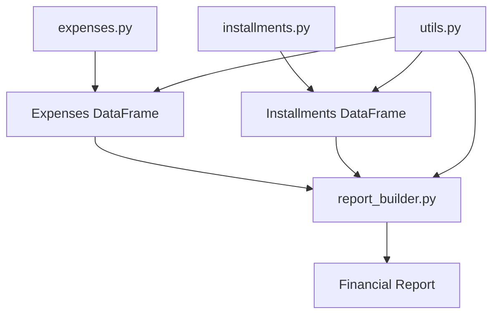

# Personal Finance

< DEVELOPING >

A `python` script that helps you to understand
your expenses. 

## Benefits
This report will help me to organize my financial expenses,
as well as, where are my main expenses and where I should lower it
to save more money

Therefore, this code have the <strong>main responsability</strong> to:
1. Organize the data
2. Automatize the builder report (no more excel)
3. Build code responsability
4. Fast solving personal financial problems

## Models
1. Expenses, find at `expenses.py`
2. Installments, find at `installments.py`
3. Utils, find at `utils.py`
4. Report Builder, find at `report_builder.py`

